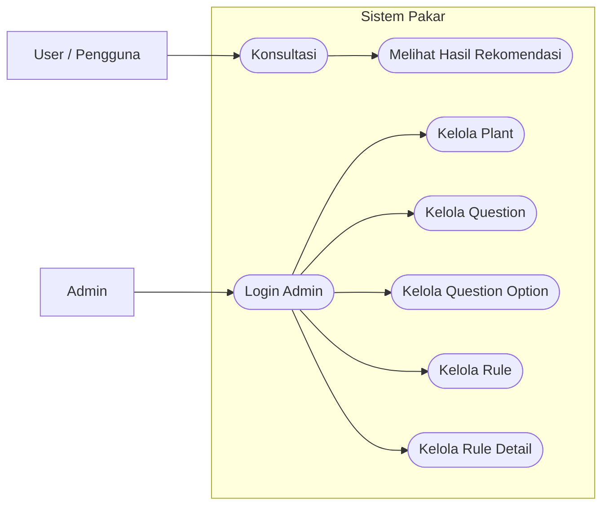

# Mermaid: Flowchart & Use Case

Dokumen ini berisi contoh diagram untuk memvisualisasikan sistem **Sistem Pakar Forward Chaining**.

> Anda bisa copy-paste isi blok `mermaid` ke tools yang mendukung Mermaid (mis. GitHub, Obsidian, Mermaid Live Editor).

---

## 1) Flowchart Proses Konsultasi (Forward Chaining)

```mermaid
flowchart TD
    A([Mulai Konsultasi]) --> B[Input jawaban pengguna]
    B --> C[Konversi jawaban ke kondisi (question_option)]
    C --> D[Ambil seluruh rule dari database]
    D --> E[Forward chaining: cocokkan rule dengan kondisi]
    E --> F{Ada rule yang
syaratnya terpenuhi?}

    F -- Ya --> G[Tambahkan plant kandidat
ke hasil]
    G --> H[Lanjutkan iterasi rule
sampai tidak ada kondisi baru]
    H --> I([Rekomendasi tanaman])
    I --> J([Tampilkan hasil & deskripsi tanaman])
    J --> K([Selesai])

    F -- Tidak --> L[Rule tidak terpenuhi]
    L --> M[Langkah berikutnya / iterasi
rule lain]
    M --> E
```

---

## 2) Use Case Diagram (Aktor: User & Admin)



---

## 3) Use Case (teks ringkas)

### User / Pengguna
- **Konsultasi**: memilih jawaban untuk pertanyaan yang tersedia
- **Melihat hasil rekomendasi**: sistem menampilkan tanaman yang paling sesuai berdasarkan forward chaining

### Admin
- **Login Admin**
- **Kelola Plant**
- **Kelola Question**
- **Kelola Question Option**
- **Kelola Rule**
- **Kelola Rule Detail**

---

Jika Anda ingin, diagram Mermaid bisa dibuat lebih “diagram standar UML Use Case” (menggunakan `classDiagram`/`sequenceDiagram` atau format use-case style khusus), tapi file ini sudah cukup untuk dokumentasi di README/GitHub.

